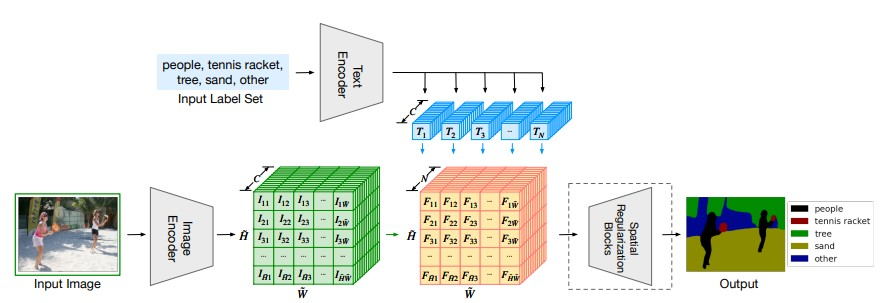

# Language driven semantic segmentation

My implementation of the "Lseg: language driven semantic segmentation" paper by Boyi Li et al.

They try to hence semantic segmentation labeling with the help of NLP, especifically with a clever integration with the CLIP model.  

## Architecture

A dense prediction transformer (DPT) with a modified head encodes at pixel level 

## Dataset 
We will train our model only on the ADE20K and COCOPanoptic datasets. We use [MSeg-API](https://github.com/mseg-dataset/mseg-api/tree/master) to download and relabel them. I recommend following its [instructions](https://github.com/mseg-dataset/mseg-api/blob/master/download_scripts/README.md) step by step but with a few modifications:

- `mseg-api` should be cloned in the repo main directory.   
- In the scripts from the `mseg-api/download_scripts` folder you need to comment parts regarding other datasets.
- Place the download for the dataset into `data/` (data is a directory in the repo directory). This is done when you define `MSEG_DST_DIR`. 

Once everything is downloaded, we use `mseg-semantic utils` [link](https://github.com/mseg-dataset/mseg-semantic/blob/master/mseg_semantic/utils/dataset.py) to interact with the data and create the dataloader. 

- I needed to change `ade20k_images_dir = "data/mseg_dataset/ADE20K/"` to `ade20k_images_dir = "data/mseg_dataset/ADE20K/ADEChallengeData2016/"` in `Lseg/utils/util.py` , otherwise an error shows up. 
- Use `test_data_utils.ipynb` to check `get_dataset` from `utils` is fetching the images correctly. In my case, the folder `train2017` wasn't inside the `images` folder, so I had to create it myself. Once that is done, `coco` dataset can be used. 

<!-- 
### Training the dense prediction transformer (DPT)

### Training Lseg -->

## Acknowledgements
- To Richard Zhao for answering all my annoying questions