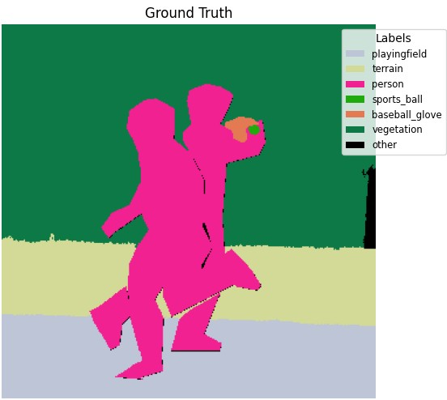

# Language driven semantic segmentation

My implementation of the "Lseg: language driven semantic segmentation" paper by Boyi Li et al.

## Architecture

A dense prediction transformer (DPT) with a modified head encodes at pixel level, and the CLIP model encodes a set of words. Both embeddings are later combined in a multimodal latent space (orange tensor in the image) which will be later compared to the ground truth labels of an annotated image. 
## Results 

## Dataset 
We will train our model only on the ADE20K and COCOPanoptic datasets. We use [MSeg-API](https://github.com/mseg-dataset/mseg-api/tree/master) to download and relabel them. I recommend following its [instructions](https://github.com/mseg-dataset/mseg-api/blob/master/download_scripts/README.md) step by step but with a few modifications:

- `mseg-api` should be cloned in the repo main directory.   
- In the scripts from the `mseg-api/download_scripts` folder you need to comment parts regarding other datasets.
- Place the download for the dataset into `data/` (data is a directory in the repo directory). This is done when you define `MSEG_DST_DIR`. 

Once everything is downloaded, we use `mseg-semantic utils` [link](https://github.com/mseg-dataset/mseg-semantic/blob/master/mseg_semantic/utils/dataset.py) to interact with the data and create the dataloader. 

- I needed to change `ade20k_images_dir = "data/mseg_dataset/ADE20K/"` to `ade20k_images_dir = "data/mseg_dataset/ADE20K/ADEChallengeData2016/"` in `Lseg/utils/util.py` , otherwise an error shows up. 
- Use `test_data_utils.ipynb` to check we are fetching the images correctly. In my case, for the COCO dataset, nor the folder `train2017` nor `val2017` was inside `data/COCOPanoptic/images/` so I had to create the folder myself and put both inside.
<!-- 
### Training the dense prediction transformer (DPT)

### Training Lseg -->

## Acknowledgements
- To Richard Zhao for answering all my annoying questions
- Useful repositories:
    - https://github.com/rzhao5659/2024-LSeg/tree/main
    - https://github.com/isl-org/lang-seg
    - https://github.com/mseg-dataset/mseg-api